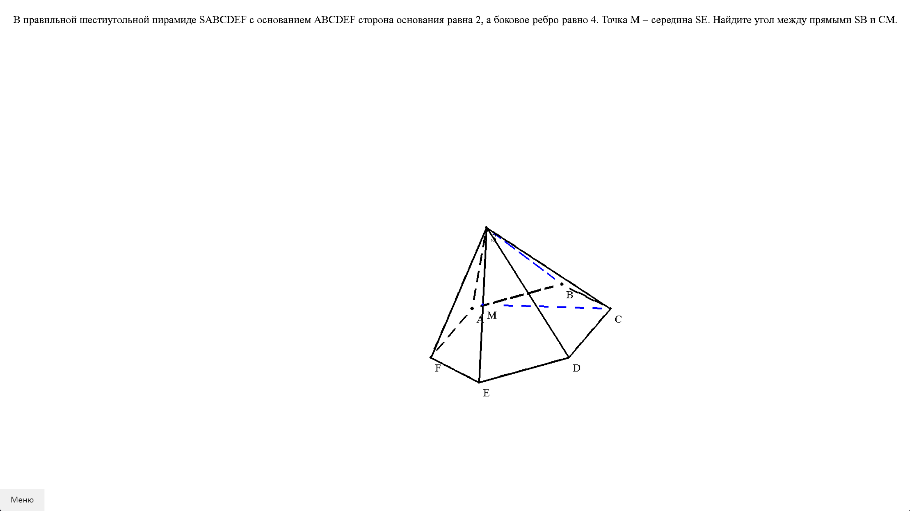
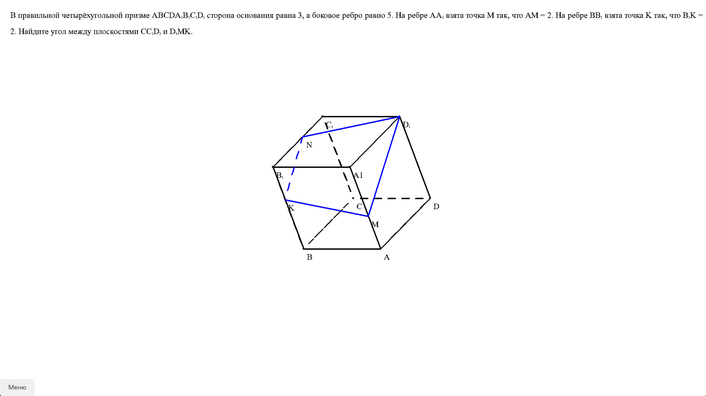
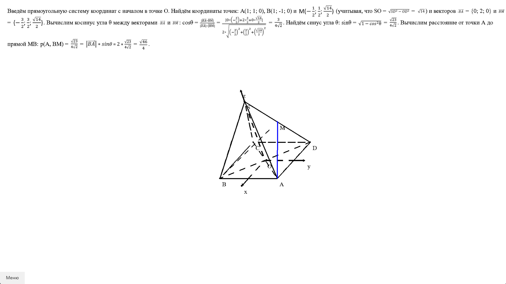

# Самоучитель по векторно-координатному способу решения стереометрических задач

<p align="center">
  
  
  
</p>

# Как запустить проект?

Достаточно скачать архив из релизов, а после запустить main.exe (static должен находится в одной директории с main.exe)
(антивирус будет ругаться, но с этим я ничего поделать не могу, можете собрать программу сами, если боитесь подвоха)<br>
***exe файл скомпилирован для 64-битных систем***

# Как запустить проект из исходного кода?

### 1. Клонируйте репозиторий

```bash
git clone https://github.com/LaGGgggg/yp_p2p_api.git
cd yp_p2p_api
```

### 2. Создайте виртуальное окружение

#### С помощью [pipenv](https://pipenv.pypa.io/en/latest/):

```bash
pip install --user pipenv
pipenv shell  # create and activate
```

#### Или классическим методом:

```bash
python -m venv .venv  # create
.venv\Scripts\activate.bat  # activate
```

### 3. Установите зависимости

```bash
pip install -r requirements.txt
```

### 4. Запустите проект

```bash
python main.py
```
